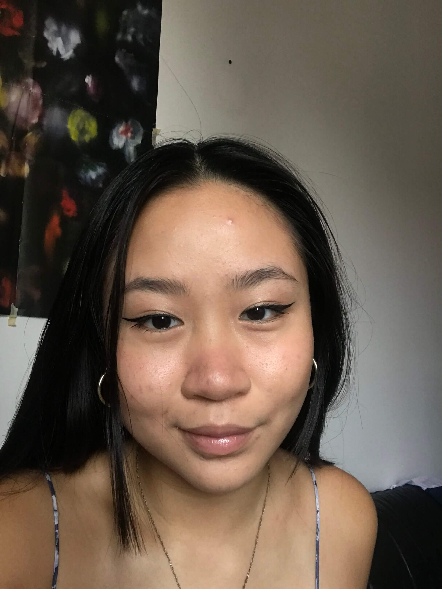
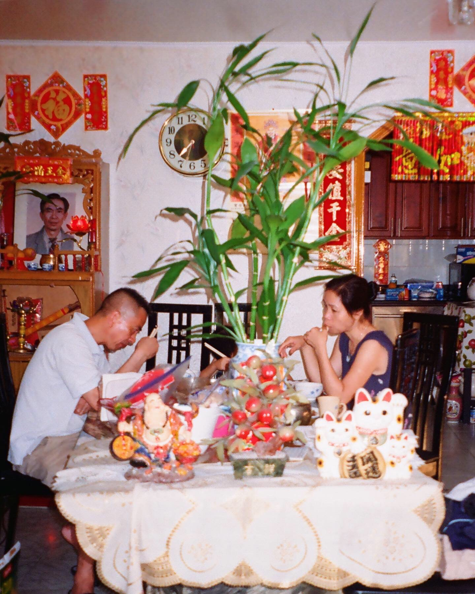

# **HELLO, I'M _TIFFANY ZHONG_!** 
*I'm currently a third year majoring in Cognitive Science with a Specialization in ~~Human Computer Interaction~~ Design and Interaction and minoring in Computer Science.*

## TABLE OF CONTENTS
1. [Go to about me](#about-me) 
2. [Go to about me as a programmer](#as-a-programmer)
3. [Go to about me as a person](#as-a-person)
## **ABOUT ME....**
### ***AS A PROGRAMMER***
My first introduction to computer science was in my sophomore year of highschool, where I took an introduction to computer science course. The first programming language that I learned was [*NetLogo*](https://ccl.northwestern.edu/netlogo/). *NetLogo* involved typing a lot of `ask patches`. Throughout my journey as a programmer I have picked up the following progamming languages:
- NetLogo
- Python
- C++
- Java
- HTML & CSS
- MATLAB
### ***AS A PERSON***
My career interests lie within the world of UX desgin/research and front end development. Aside from my career aspirations, my hobbies include(ranked by favorability):
1. Film photography 
2. Paddleboarding 
3. Thrifting
4. Drawing 
5. Cooking
Here's a photo I took of my family a while back: 

A quote that I often refer back to in life is:
> This too shall pass.

On my free time I'm working towards completing my San Diego bucketlist before I graduate from UCSD: 
- [ ] Visit all the Hidden Swings
- [x] Try surfing
- [x] Hike the Ho Chi Minh Trail
- [ ] Go cliff jumping
- [ ] Sand dunes
- [x] Paddleboarding at Coronado
- [ ] Cowles mountain hike
This is a growing list, so please let me know if there are any other things I should add to my bucketlist! 